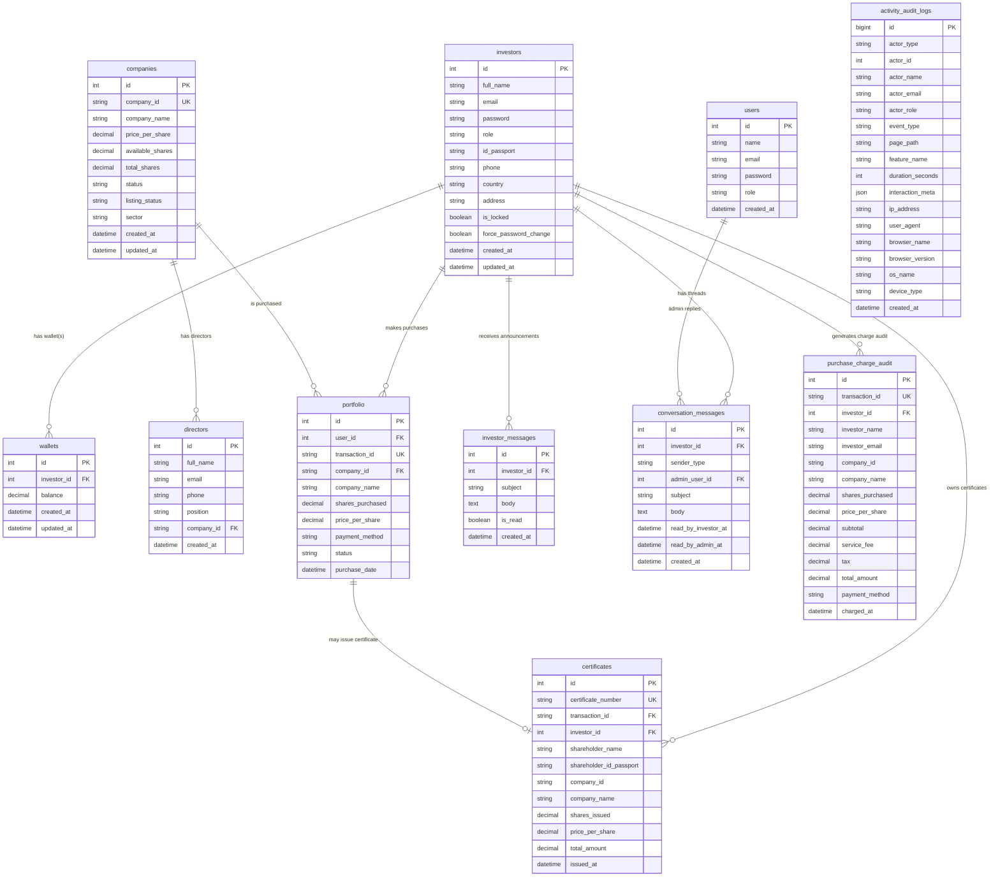

# PrivateEx ERD (Current Platform)

## Notes

- This ERD reflects the **current implementation** in code.
- Some tables are created in code (`conversation_messages`, `investor_messages`, `purchase_charge_audit`, `activity_audit_logs`), while others are pre-existing but actively queried/updated.
- `activity_audit_logs.actor_id` is polymorphic (`investors.id` or `users.id`) depending on `actor_type`.

